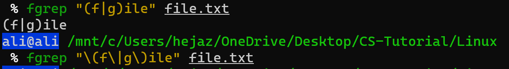

# Search File Content
One of the renowned search tool on Unix-like systems which can be used to search for anything whether it be a file, or a line or multiple lines in file is `grep` utility. It is very vast in functionality which can be attributed to the large number of options it supports like: searching using string pattern, or reg-ex pattern or perl based reg-ex etc.

`grep` is a command-line utility for searching plain-text data sets for lines that match a regular expression. Its name comes from the `ed` command `g/re/p` (globally search for a regular expression and print matching lines), which has the same effect.

Due its varying functionalities, it has many variants including `grep`, `egrep` (Extended GREP), `fgrep` (Fixed GREP), `pgrep` (Process GREP), `rgrep` (Recursive GREP) etc. But these variants have minor differences to original grep which has made them popular and to be used by various Linux programmers for specific tasks.

## `grep`
`grep` or Global Regular Expression Print is the main search program on Unix-like systems which can search for any type of string on any file or list of files or even output of any command.

### Command Examples
Below is some standard grep command explained with examples to get you started with grep on Linux, macOS, and Unix:

1. Search any line that contains the _word_ in filename on Linux: `grep 'word' filename`
2. Perform a case-insensitive search for the word _bar_ in Linux and Unix: `grep -i 'bar' file1`
3. Look for all files in the current directory and in all of its subdirectories in Linux for the word _httpd_: `grep -R 'httpd' .`
4. Search and display the total number of matching lines that the string _nixcraft_ appears in a file named `frontpage.md`: `grep -c 'nixcraft' frontpage.md`

### Syntax
The syntax is as follows:
```bash
grep 'word' filename
fgrep 'word-to-search' file.txt
grep 'word' file1 file2 file3
grep 'string1 string2'  filename
cat otherfile | grep 'something'
command | grep 'something'
command option1 | grep 'data'
grep --color 'data' fileName
grep [-options] pattern filename
fgrep [-options] words file
```

### How to use grep recursively
You can search recursively i.e. read all files under each directory for a string hello

```bash
grep -r "hello" .
grep -R "hello" .
```


The inclusion of the file names in the output data can be suppressed by using the `-h` option as follows:


### Search Words Only
When you search for _he_, `grep` will match _he_, _hello_, _she_ and more. You can force the grep command to select only those lines containing matches that form whole words i.e. match only _he_ word:

```bash
grep -w "boo" file
```

### Invert Match
You can use `-v` option to print inverts the match; that is, it matches only those lines that do not contain the given word. For example print all line that do not contain the word `hello`:

```bash
grep -v hello file.txt
```

### Count Line When Word is Matched
The grep can report the number of lines that the pattern has been matched for each file using `-c` (count) option:
```bash
grep -c 'word' /path/to/file
```

Pass the `-n` option to precede each line of output with the number of the line in the text file from which it was obtained:
```bash
grep -n 'hello' file.txt
```

For example, display cpu model name:
```bash
cat /proc/cpuinfo | grep -i 'Model'
```

However, above command can be also used as follows without shell pipe:
```bash
grep -i 'Model' /proc/cpuinfo
```

### Colors Option
Finally, we can force grep to display output in colors, enter:

```bash
grep --color 'hello' file.txt
```

### Piping
`grep` command often used with shell pipes. In this example, show the name of the hard disk devices:

## `egrep`
Main thing that remains to be investigated is what are the differences between the three main variants i.e. `grep`, `egrep` and `fgrep` of `grep` that makes Linux users choose one or the other version as per requirement.

`grep` uses Basic Regular Expressions apart from normal strings as a search pattern. In Basic Regular Expressions (BRE), meta-characters like: `'{'`, `'}'`, `'('`, `')'`, `'|'`, `'+'`, `'?'` loose their meaning and are treated as normal characters of string and need to be escaped if they are to be treated as special characters.


`egrep` or `grep -E` is another version of grep or the Extended grep. This version of grep is efficient and fast when it comes to searching for a regular expression pattern as it treats meta-characters as is and doesnt substitute them as strings like in grep, and hence you are freed from the burden of escaping them as in grep. It uses ERE or the Extended Regular Expression set.

In case of egrep, even if you do not escape the meta-characters, it would treat them as special characters and substitute them for their special meaning instead of treating them as part of string.


Like here, egrep searched for `file` string when the meta-characters were not escaped as it would mean by the meaning of these characters. But, when these characters were escaped, then egrep treated them as part of string and searched for complete string `(f|g)ile` in the file.

## `fgrep`
`fgrep` or the Fixed grep or `grep -F` is yet another version of grep which is fast in searching when it comes to search for the entire string instead of regular expression as it doesnt recognize the regular expressions, neither any meta-characters. For searching any direct string, this is the version of grep which should be selected.

Fgrep searches for complete string and doesnt even recognize special characters as part of regular expression even if escaped or not escaped.



Like, when meta-characters were not escaped, fgrep searched for the complete string `(f|g)ile` in the file, and when the meta-characters were escaped, then the fgrep command searched for `\(f\|g\)ile` all characters as is in the file.

## Summary
- Above highlighted are the differences between `grep`, `egrep` and `fgrep`. Apart from difference in the set of regular expressions used, and speed of execution, rest command line parameters remain same for all the three versions of grep and even instead of `egrep` or `fgrep`, `grep -E` or `grep -F` are recommended to be used.
- `grep` is used to search data for certain text.
- `grep` returns lines that contain a piece of text (wildcards work too!)
- `grep` works great with piped data.
- Options covered:
    - `-i`: case insensitive.
    - `-c`: count number of lines where word is matched.
    - `-v`: inverted match.
    - `-r`: directory recursive find.
    - `-n`: precede each line of output with the number of the line in the text file.
    - `-w`: search word only.