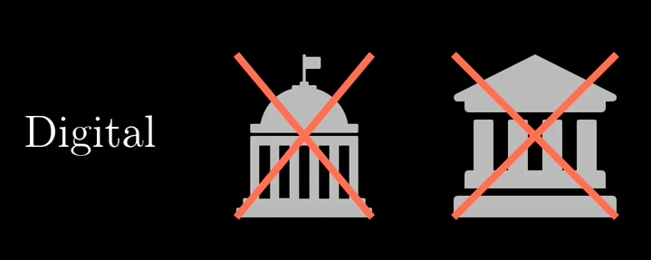
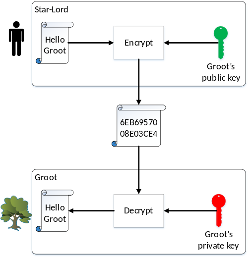
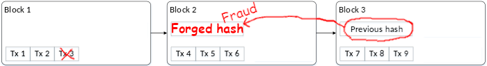
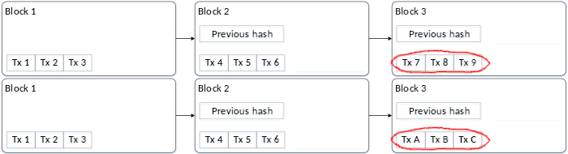
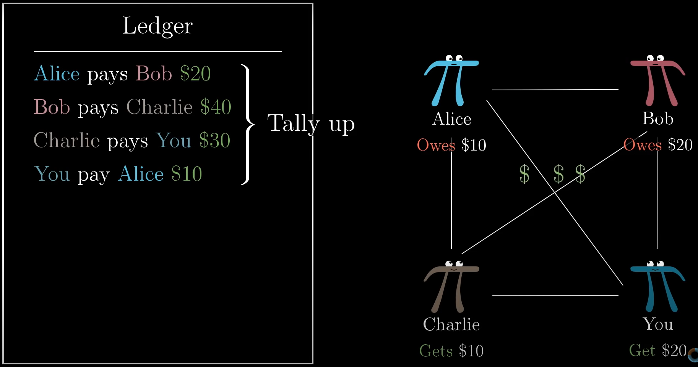
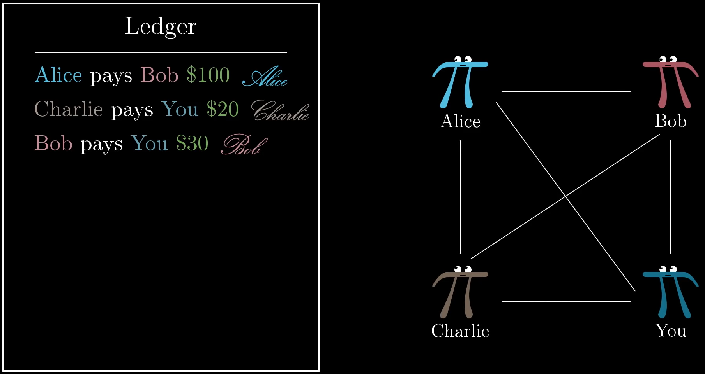
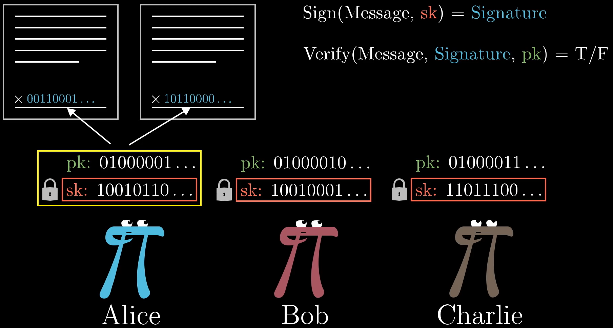
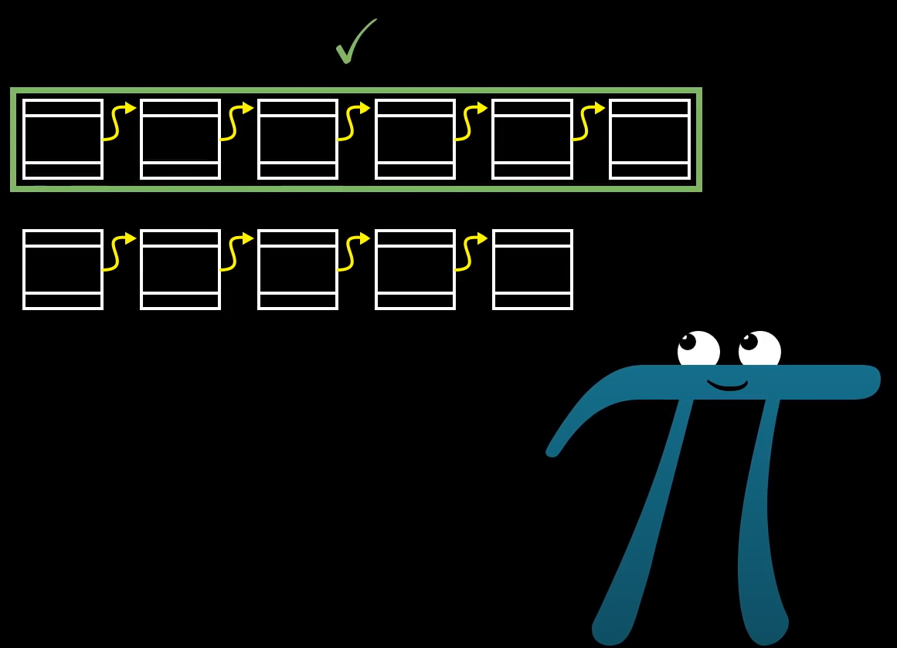

# Blockchain

The goal of blockchain is to allow digital information to be recorded and distributed, but not edited. Blockchain technology was first outlined in 1991 by Stuart Haber and W. Scott Stornetta, two researchers who wanted to implement a system where document timestamps could not be tampered with. But it wasn’t until almost two decades later, with the launch of Bitcoin in January 2009, that blockchain had its first real-world application.

The Bitcoin protocol is built on a blockchain. In a research paper introducing the digital currency, Bitcoin’s pseudonymous creator, Satoshi Nakamoto, referred to it as “a new electronic cash system that’s fully peer-to-peer, with no trusted third party.”

The key thing to understand here is that Bitcoin merely uses blockchain as a means to transparently record a ledger of payments, but blockchain can, in theory, be used to immutably record any number of data points. As discussed above, this could be in the form of transactions, votes in an election, product inventories, state identifications, deeds to homes, and much more.

Currently, there is a vast variety of blockchain-based projects looking to implement blockchain in ways to help society other than just recording transactions. One good example is that of blockchain being used as a way to vote in democratic elections. The nature of blockchain’s immutability means that fraudulent voting would become far more difficult to occur. 

Bitcoin is the world’s first and most popular digital currency. It is decentralized and controlled by no one. How does it work, and why can you trust it?

Bitcoin is essentially just a ledger of entries saying who transferred how many bitcoins to whom, all digitally signed by their owners. This much is like a financial ledger on paper with handwritten signatures authorizing each entry. When you send someone bitcoins, your signed transaction is appended to this ledger.

So what prevents me from making forging transactions for bitcoins I don’t own?

Bitcoin works by solving three record-keeping challenges without the need for a central record keeper like a bank:
1. Proving ownership of bitcoins.
2. Preventing tampering with records of past transaction.
3. Providing an authoritative ledger of transactions that is trustworthy.

## Challenge #1: Proving Ownership
The first challenge for Bitcoin is proving ownership. When the owner of a bitcoin publishes a transaction to the network, how do we know that it actually came from that bitcoin’s owner and not an imposter? The answer to this lies in computer encryption.

### Public/Private Key Encryption

Bitcoin is based on a form of encryption called **public/private key encryption**. In this encryption, you generate two keys. Data encrypted with one key can be decrypted by the other and vice versa. One of these keys you make public and the other you keep a private secret.

This opens the door for sending secret messages.

This opens the door for sending secret messages. Let’s use the characters from Guardians of the Galaxy for a fun example. Suppose that Star-Lord, the hero, wants to send a secret message “Hello Groot” to his tree-shaped friend Groot and ensure the movie’s arch-villain Thanos can’t read it. Groot has created a pair of public/private keys. Star-Lord takes Groot’s public key and uses it to encrypt the message. The message while in transit looks like gibberish, but when Groot receives it, his private key is able to decrypt it.

### Digital Signing
Using these keys in reverse can also be used to verify the authenticity of who created the data, and that is how Bitcoin employs it. Now suppose Groot wants to send Star-Lord the message “I am Groot.” There is no reason to encrypt it because we all know that’s the only thing Groot says, but Groot wants to prove to Star-Lord that the message indeed came from Groot, not some 3rd party imposter. Groot would encrypt the message with his own private key. When Star-Lord receives the message and decrypts it with Groot’s public key, he sees “I am Groot.” This message is not a secret, but the fact that Groot’s public key decrypted it is proof that it was generated using Groot’s private key. Thus it proves the authenticity of the message

### Signing Bitcoin Transactions
Bitcoin wallets are in fact public/private key pairs. When someone gives you his wallet ID, that ID is actually his public key. When you send coins to another wallet, the Bitcoin software uses your public key to authenticate that the transaction came from you, not an imposter.

If Groot wanted to send a bitcoin in his wallet to Star-Lord, he would generate a message declaring he’s transferring the bitcoin to Star-Lord’s wallet and use his private key to sign the message. So long as everyone agrees that the bitcoin being transferred indeed belonged to Groot’s public key wallet, the fact his public key can decipher this transaction proves Groot created this transaction. If Thanos instead forged a message claiming Groot sent him the bitcoin, everyone would know it was a fake since Groot’s public key would not be able to decipher any transactions written by Thanos.

## Challenge #2: Tampering with the Ledger

The next challenge is how to prevent tampering with the ledger. For example, if I send bitcoins to a friend, then a month later regret it, what’s to prevent me from going back and deleting the transaction from the ledger or changing the amount I had sent? This is dealt with using something called hashing.

### Hashing
A hash is an algorithm for validating the integrity of data. Any message can generate a hash value, but small changes in the message result in radical changes in the hash value. For example, here are two messages and their hash values:

- My name is David Mooter: `FE100DDA6D28B2280B34FC228ADAB42E`
- My name is Davis Mooter: `1761420899A8F0B731A2EE56A6F71567`

Suppose you are looking at an archive of a message I wrote My name is David Mooter. If you know in advance that this message I wrote in the past had a hash value of `FE100DDA6D28B2280B34FC228ADAB42E`, you can then validate the message wasn’t tampered with by confirming it does indeed generate that hash. If someone tampered with this record changing it to My name is Davis Mooter, then you would get the hash value `1761420899A8F0B731A2EE56A6F71567` and know someone had tampered with it.

### The "Blockchain"
Blockchain seems complicated, and it definitely can be, but its core concept is really quite simple. A blockchain is a type of database.

Bitcoin uses hashes to validate its ledger has not been tampered with. Periodically a collection of transactions are published together as one new record, called a block. Each block stores the hash of the block of transactions that preceded it. For example, take the transactions shown in this ledger of three blocks, each of which recorded three transactions labelled tx 1 through tx 9.

If I went back to delete transaction 3 from the first block, everyone would know that’s invalid because the hash in block 2 would prove block 1 was tampered with.

Fine, then I will also edit block 2 to have a hash that validates my forged block 1. This doesn’t work, either, because the hash value in block 2 that I just modified was an input to generate block 3’s validation hash, so now block 3’s hash reveals that block 2 has been tampered with.

In sum, modifying one piece of the ledger is impossible: tampering with one transaction would require modifying the hash value of every block of transactions that followed it, which means generating a whole new ledger. This is why it is called blockchain: it is as though all the blocks are tightly chained together and cannot be unlinked from each other.

## Challenge #3: Which Ledger is the Correct One

Even though one particular blockchain ledger is tamper-proof, what’s to prevent me from creating alternative competing ledgers? How do we know which ledger is the trusted one?

For example, suppose our blockchain has two blocks. Then I publish three new transactions appended to the ledger, but at the same time, I additionally publish three alternate transactions also appended to the ledger. Now we have two competing blockchains.

### Proof of Work

This is solved through a concept called proof of work. Computers convert the hash values I described in the previous section into a sequence of zeros and ones like this:

`0010111011110100000001000001101010010010001011101111100001001010`

Suppose we imposed a constraint that a block cannot be added to the ledger unless the hash validating the previous block starts with a zero, then we would have a 1/2 chance of getting a hash that works.

`0XXXXXXXXXXXXXXXXXXXXXXXXXXXXXXXXXXXXXXXXXXXXXXXXXXXXXXXXXXXXXXX`

Similarly, if we imposed a constraint that it must start with two zeros, then there would be a 1/4 chance. (We’d accept 00 but reject 01, 10, and 11.)

`00XXXXXXXXXXXXXXXXXXXXXXXXXXXXXXXXXXXXXXXXXXXXXXXXXXXXXXXXXXXXXX`

This grows exponentially. For example, if the constraint is that it must start with 32 zeros, then there would be approximately a 1 in 4 billion chance.

`00000000000000000000000000000000XXXXXXXXXXXXXXXXXXXXXXXXXXXXXXXX`

Bitcoin imposes such a constraint. Yet the hash of the previous block will always be constant. How do you get a hash that meets this constraint with a fixed input? By adding a random arbitrary value to every block. This is known as a “nonce” value.

This nonce is combined with the previous block when computing the hash. Before adding a block to the ledger, computers around the world churn through random values searching for a nonce value that, when combined with the previous block, results in a hash that starts with a certain number of zeros. Finding that nonce value is the “proof of work.” (Incidentally, when a computer finds a hash that can be published, it includes a wallet, and that wallet is awarded free bitcoins. That is how new bitcoins are generated.)

This is so computationally intense that we can predict on average how long it will take. In Bitcoin’s case, it is one block every 10 minutes on average. Computers get more powerful as time progresses, so Bitcoin increases the difficulty to keep pace with advancing computer speeds by requiring more zeros every time a certain number of blocks is published.

### Longest Ledger is the Oldest
Since proof of work makes it impossible to publish new blocks faster than a certain rate, we know that any ledger that is longer than another is also older. It would be impossible for me to produce a blockchain ledger that is longer than the official one unless I had more computing power at my personal disposal than the whole rest of all bitcoin users combined.
In sum, when there are competing ledgers on the Internet, all Bitcoin users recognize the one with the most blocks as the oldest and therefore authentic ledger.

## Summary
So there you have an explanation of Bitcoin in three easy steps:

- Digital signatures validate the ownership of bitcoins.
- Hashes validate the integrity of transactions listed on the ledger.
- Proof of work prevents the creation of rogue ledgers.

## Summary of Steps

### pk/sk
1. Anyone can add lines to the ledger.
2. Settle up with real money each month.

Problem: Anyone can add a line! How are we supposed to trust that all these transactions are what the sender meant them to be?

- Solution: **Digital Signatures**!

This is where the first bit of cryptography comes in: Digital Signature. Like handwritten signature the idea is that Alice should be able to add something next to that transaction that:
- proves she has seen it,
- proves she approves it,
- and it should be infeasible for anyone else to forge her signature.

Couln't you just copy the signature? How do you prevent forgeries?

- Solution: **Public Key (pk)/ Private Key or Secret Key (sk) pair**

`Sign(message, sk) = Signature`
`Verify(message, signature, pk) = True/False`

The signature have 256. This is a very large number. You can feel extremely confident that the only way someone could have produced it is if they knew the secret key associated with the public key you used for verification.

You also can't copy the transactions as each has a unique id. So the signatures are different for the same transaction that is done multiple times.

### Centralized/Decentralized
But this ledger is public! Everyone can add new lines! To remove that bit of trust, we'll have everyone keep their own copy of the ledger.

But for example when Bob receives the transaction "Alic pays Bob 10 LD", how can he be sure that everyone else receives and believes that same transaction? So that he'll be able to later use those 10 LD to make a trade with Charlie for example.

This is the problem addressed in the original bitcoin paper.
At high level, the solution bitcoin offers is to trust whichever ledger has the most computational work. Then it would require an infeasible amount of computation to make a fraud.

To reward a block creator for all this work, when she puts together a block, we'll allow her to include a special transaction at the top in which she gets, say 10 LD.

Creating blocks is often called "mining" since it requires a lot of work and it introduces new bits of currency.

The key additions is that if you hear of two distinct blockchains with conflicting transaction histories, you defer to the longest one, the one that put the most work put into it.

If there's a tie, wait until you hear of an additional block that makes one longer.

