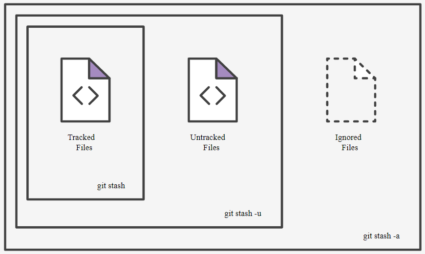

# Stashing Your Work

The `git stash` command takes your uncommitted changes (both staged and unstaged), saves them away for later use, and then reverts them from your working copy. For example:

```bash
$ git status
On branch master
Changes to be committed:

    new file:   style.css

Changes not staged for commit:

    modified:   index.html

$ git stash
Saved working directory and index state WIP on master: 5002d47 our new homepage
HEAD is now at 5002d47 our new homepage

$ git status
On branch master
nothing to commit, working tree clean
```

At this point you're free to make changes, create new commits, switch branches, and perform any other Git operations; then come back and re-apply your stash when you're ready.

Note that the stash is local to your Git repository; stashes are not transferred to the server when you push.

## Re-applying your stashed changes
You can reapply previously stashed changes with `git stash pop`:
```bash
git stash pop
```

Popping your stash removes the changes from your stash and reapplies them to your working copy.

Alternatively, you can reapply the changes to your working copy and keep them in your stash with `git stash apply`:
```bash
git stash apply
```

This is useful if you want to apply the same stashed changes to multiple branches.

Now that you know the basics of stashing, there is one caveat with `git stas`h you need to be aware of: by default Git won't stash changes made to **untracked** or **ignored files**.

## Stashing untracked or ignored files
By default, running `git stash` will stash:

- changes that have been added to your index (staged changes)
- changes made to files that are currently tracked by Git (unstaged changes)

But it will **not** stash:
- New files in your working copy that have not yet been staged
- files that have been ignored

So if we add a third file to our example above, but don't stage it (i.e. we don't run `git add`), `git stash` won't stash it.

Adding the `-u` option (or `--include-untracked`) tells `git stash` to also stash your untracked files:
```bash
git stash -u
```

You can include changes to ignored files as well by passing the `-a` option (or `--all`) when running `git stash`.



## Managing multiple stashes

You aren't limited to a single stash. You can run `git stash` several times to create multiple stashes, and then use `git stash list` to view them. By default, stashes are identified simply as a **WIP** – work in progress – on top of the branch and commit that you created the stash from. After a while it can be difficult to remember what each stash contains:

```bash
$ git stash list
stash@{0}: WIP on master: 5002d47 our new homepage
stash@{1}: WIP on master: 5002d47 our new homepage
stash@{2}: WIP on master: 5002d47 our new homepage
```

To provide a bit more context, it's good practice to annotate your stashes with a description, using `git stash save "message"`:

```bash
$ git stash save "add style to our site"
Saved working directory and index state On master: add style to our site
HEAD is now at 5002d47 our new homepage

$ git stash list
stash@{0}: On master: add style to our site
stash@{1}: WIP on master: 5002d47 our new homepage
stash@{2}: WIP on master: 5002d47 our new homepage
```

By default, git stash pop will re-apply the most recently created stash: `stash@{0}`

You can choose which stash to re-apply by passing its identifier as the last argument, for example:

```bash
git stash pop stash@{2}
```

## Viewing stash diffs
You can view a summary of a stash with `git stash show`:
```bash
$ git stash show
index.html | 1 +
style.css | 3 +++
2 files changed, 4 insertions(+)
```

Or pass the `-p` option (or `--patch`) to view the full diff of a stash:
```bash
git stash show -p
```

## Partial stashes
You can also choose to stash just a single file, a collection of files, or individual changes from within files. If you pass the `-p` option (or `--patch`) to `git stash`, it will iterate through each changed "hunk" in your working copy and ask whether you wish to stash it:
```bash
git stash -p
```

You can hit `?` for a full list of hunk commands. Commonly useful ones are:

|Command|Description|
|:--|:--|
|`/`|search for a hunk by regex|
|`?`|help|
|`n`|don't stash this hunk|
|`q`|quit (any hunks that have already been selected will be stashed)|
|`s`|split this hunk into smaller hunks|
|`y`|stash this hunk|

There is no explicit "abort" command, but hitting `CTRL-C` will abort the stash process.

## Cleaning up your stash
If you decide you no longer need a particular stash, you can delete it with `git stash drop`:

```bash
git stash drop stash@{0}
```

Or you can delete all of your stashes with:
```bash
git stash clear
```

## Summary
- Stash your work (any will do)
```bash
$ git stash save
$ git stash
```

- See what you got
```bash
$ git stash list
```

- Apply
```bash
$ git stash apply stash@{0}
```

- Clean up (any will do)
```bash
$ git stash drop stash@{0}
$ git stash pop
$ git stash clear
```
