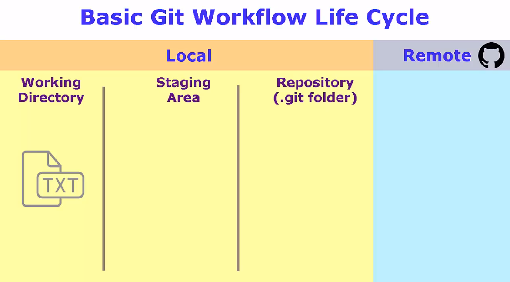

# Key Concepts

First, in Git, collections of version controlled files are kept together in a repository. The repository also contains the history of changes and any special configuration. Generally speaking, a repository would contain all the files related to a specific project or application.

Next, there are three local states related to files being managed by Git:
- The working directory: the directory or folder on your computer that holds all the project or application files. Files within the working directory, may or may not be managed by Git. However, Git is aware of them.
- Staging area: In-between is the Git staging area, often referred to as the Git index, that is a holding area for queueing up changes for the next commit.
- The Git repository or the commit history: The Git repository manages the Git commit history, that is all the changes that are finalized and permanently part of the Git repository.

**Note:** Since files in the staging area haven't been committed yet, you can move the files in and out of the staging area without impacting the Git repository, and its history of changes.

The three states of Git are specific to the local Git repository, but I like to tack on a fourth state, the remote state. Although the remote repository is just another repository with its own three states internally, conceptually, I think of the remote repository as a fourth state; since it is the last step in the basic Git workflow, and since few people use Git without a corresponding remote repository.

While there are several Git hosting services (remote repository) out there, [GitHub](https://www.github.com) is by far the most popular. You can see a comparison of different git hosting services [here](https://bitbucket.org/product/code-repository).
