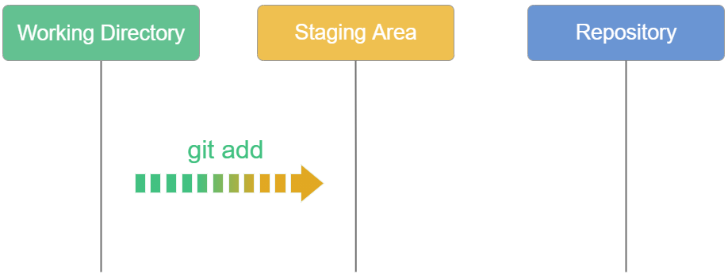

# Add and Commit
Developing a project revolves around the basic edit/stage/commit pattern. First, you edit your files in the working directory. When you’re ready to save a copy of the current state of the project, you stage changes with git add. After you’re happy with the staged snapshot, you commit it to the project history with `git commit`.

## `git add`
When working in Git, or other version control systems, the concept of "saving" is a more nuanced process than saving in a word processor or other traditional file editing applications. The traditional software expression of "saving" is synonymous with the Git term "committing" and Git committing is an operation that acts upon a collection of files and directories.

The `git add <file>` command adds a change in the working directory to the staging area. It tells Git that you want to include updates to a particular file in the next commit. However, `git add <file>` doesn't really affect the repository in any significant way—changes are not actually recorded until you run `git commit`.

The primary function of the `git add` command, is to promote pending changes in the working directory, to the git staging area. The staging area is one of Git's more unique features, and it can take some time to wrap your head around it. The staging area is considered one of the "three trees" of Git, along with, the working directory, and the commit history.

Instead of committing all of the changes you've made since the last commit, the stage lets you group related changes into highly focused snapshots before actually committing it to the project history. This means you can make all sorts of edits to unrelated files, then go back and split them up into logical commits by adding related changes to the stage and commit them piece-by-piece. As in any revision control system, it’s important to create atomic commits so that it’s easy to track down bugs and revert changes with minimal impact on the rest of the project.

## `git commit`

The `git commit` command captures a snapshot of the project's currently staged changes. Committed snapshots can be thought of as “safe” versions of a project—Git will never change them unless you explicitly ask it to. Prior to the execution of `git commit`, The `git add` command is used to promote or 'stage' changes to the project that will be stored in a commit. These two commands `git commit` and `git add` are two of the most frequently used.

Instead of making a change and committing it directly to the central repo, Git developers have the opportunity to accumulate commits in their local repo. it makes it easier to split up a feature into atomic commits, keep related commits grouped together, and clean up local history before publishing it to the central repository. It also lets developers work in an isolated environment, deferring integration until they’re at a convenient point to merge with other users. While isolation and deferred integration are individually beneficial, it is in a team's best interest to integrate frequently and in small units.

**Note:** Git records the entire contents of each file in every commit, not the differences. This makes many Git operations much faster than other version controls such as SVN, since a particular version of a file doesn’t have to be “assembled” from its diffs—the complete revision of each file is immediately available from Git's internal database.

### Options

- `git commit`: Commit the staged snapshot. This will launch a text editor prompting you for a commit message. After you’ve entered a message, save the file and close the editor to create the actual commit.
- `git commit -a`: Commit a snapshot of all changes in the working directory. This only includes modifications to tracked files (those that have been added with `git add` at some point in their history).
- `git commit -m "commit message"`: A shortcut command that immediately creates a commit with a passed commit message. By default, `git commit` will open up the locally configured text editor, and prompt for a commit message to be entered. Passing the -m option will forgo the text editor prompt in-favor of an inline message.
- `git commit -am "commit message"`: A power user shortcut command that combines the `-a` and `-m` options. This combination immediately creates a commit of all the staged changes and takes an inline commit message.
- `git commit --amend`: This option adds another level of functionality to the commit command. Passing this option will modify the last commit. Instead of creating a new commit, staged changes will be added to the previous commit. This command will open up the system's configured text editor and prompt to change the previously specified commit message.

**What is a tracked file?** A tracked file is any file that Git is aware of and tracking actively. That would be any file that has already been committed into the Git repository, or any file that has been added to the Git index, or the Git staging area.
