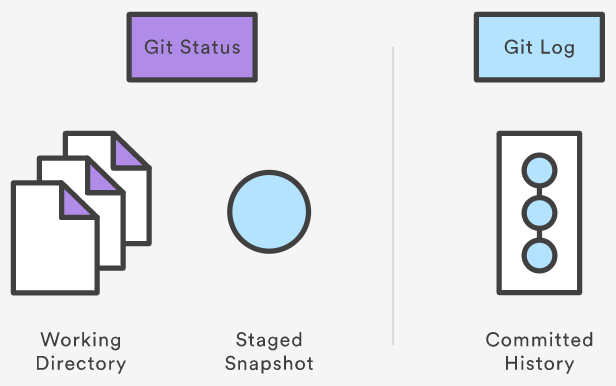

# Inspecting a Repository

## `git status`

The `git status` command displays the state of the working directory and the staging area. It lets you see which changes have been staged, which haven’t, and which files aren’t being tracked by Git. Status output does not show you any information regarding the committed project history. For this, you need to use `git log`.

`git status` list which files are staged, unstaged, and untracked.

The `git status` command is a relatively straightforward command. It simply shows you what's been going on with git add and git commit. Status messages also include relevant instructions for staging/unstaging files.

### Ignoring Files

Untracked files typically fall into two categories.
1. Files that have just been added to the project and haven't been committed yet
2. Compiled binaries like .pyc, .obj, .exe, etc.

While it's definitely beneficial to include the former in the `git status` output, the latter can make it hard to see what’s actually going on in your repository.

For this reason, Git lets you completely ignore files by placing paths in a special file called `.gitignore`. Any files that you'd like to ignore should be included on a separate line, and the * symbol can be used as a wildcard. For example, adding the following to a `.gitignore` file in your project root will prevent compiled Python modules from appearing in `git status`:

```
*.pyc
```

## `git log`
The git log command displays committed snapshots. It lets you list the project history, filter it, and search for specific changes. While `git status` lets you inspect the working directory and the staging area, git log only operates on the committed history.



Log output can be customized in several ways, from simply filtering commits to displaying them in a completely user-defined format. Some of the most common configurations of `git log` are presented below.

- `git log`: Display the entire commit history using the default formatting. If the output takes up more than one screen, you can use Space to scroll and `q` to exit.
- `git log -n <limit>`: Limit the number of commits to display. For example, `git log -n 3` will display only 3 commits.
- `git log --oneline`: Condense each commit to a single line. This is useful for getting a high-level overview of the project history.
- `git log --stat`: Along with the ordinary git log information, include which files were altered and the relative number of lines that were added or deleted from each of them.
- `git log <file>`: Only display commits that include the specified file. This is an easy way to see the history of a particular file.
- `git log -p`: Display the patch representing each commit. This shows the full diff of each commit, which is the most detailed view you can have of your project history.
- `git log -p <file>`: Display the patch representing for `<file>`
- `git log --author="<pattern>"`: Search for commits by a particular author. The  argument can be a plain string or a regular expression.
- `git log --grep="<pattern>"`: Search for commits with a commit message that matches, which can be a plain string or a regular expression.
- `git log --graph --decorate`: The --graph flag that will draw a text based graph of the commits on the left hand side of the commit messages. --decorate adds the names of branches or tags of the commits that are shown.

