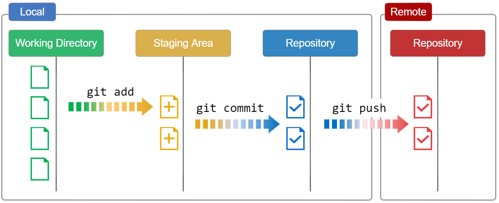

# Remote Repository
If you used `git clone` in the previous "Initializing a new Repository" section to set up your local repository, your repository is already configured for remote collaboration. `git clone` will automatically configure your repo with a remote pointed to the Git URL you cloned it from. This means that once you make changes to a file and commit them, you can git push those changes to the remote repository.

If you used `git init` to make a fresh repo, you'll have no remote repo to push changes to. A common pattern when initializing a new repo is to go to a hosted Git service like Bitbucket and create a repo there. The service will provide a Git URL that you can then add to your local Git repository and git push to the hosted repo. Once you have created a remote repo with your service of choice you will need to update your local repo with a mapping.

