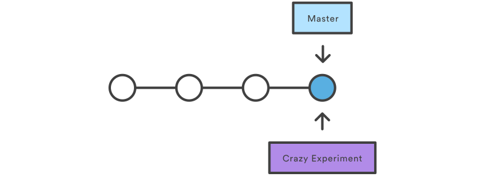

# Branching

Branching is a feature available in most modern version control systems.

In Git, branches are a part of your everyday development process. Git branches are effectively a pointer to a snapshot of your changes. When you want to add a new feature or fix a bug—no matter how big or how small—you spawn a new branch to encapsulate your changes. This makes it harder for unstable code to get merged into the main code base, and it gives you the chance to clean up your feature's history before merging it into the main branch.


The diagram above visualizes a repository with two isolated lines of development, one for a little feature, and one for a longer-running feature. By developing them in branches, it’s not only possible to work on both of them in parallel, but it also keeps the main `master` branch free from questionable code.

The implementation behind Git branches is much more lightweight than other version control system models. Instead of copying files from directory to directory, Git stores a branch as a reference to a commit. In this sense, a branch represents the tip of a series of commits—it's not a container for commits. The history for a branch is extrapolated through the commit relationships.

## How it works
A branch represents an independent line of development. Branches serve as an abstraction for the edit/stage/commit process. You can think of them as a way to request a brand new working directory, staging area, and project history. New commits are recorded in the history for the current branch, which results in a fork in the history of the project.

The git branch command lets you create, list, rename, and delete branches. It doesn’t let you switch between branches or put a forked history back together again. For this reason, `git branch` is tightly integrated with the `git checkout` and `git merge` commands.

## Command Options
|Command|Description|
|:--|:--|
|`git branch`|List all of the branches in your repository. This is synonymous with `git branch --list`.|
|`git branch <branch>`|Create a new branch called `＜branch＞`. This does not check out the new branch.|
|`git branch -d <branch>`|Delete the specified branch. This is a “safe” operation in that Git prevents you from deleting the branch if it has unmerged changes.|
|`git branch -D <branch>`|Force delete the specified branch, even if it has unmerged changes. This is the command to use if you want to permanently throw away all of the commits associated with a particular line of development.|
|`git branch -m <branch>`|Rename the current branch to `＜branch＞`.|
|`git branch -a`|List all remote branches. |

## Creating Branches
It's important to understand that branches are just pointers to commits. When you create a branch, all Git needs to do is create a new pointer, it doesn’t change the repository in any other way. If you start with a repository that looks like this:


Then, you create a branch using the following command:
```
git branch crazy-experiment
```
The repository history remains unchanged. All you get is a new pointer to the current commit:



Note that this only creates the new branch. To start adding commits to it, you need to select it with `git checkout`, and then use the standard `git add` and `git commit` commands.

## Deleting Branches
Once you’ve finished working on a branch and have merged it into the main code base, you’re free to delete the branch without losing any history:
```
git branch -d crazy-experiment
```
However, if the branch hasn’t been merged, the above command will output an error message:
```
error: The branch 'crazy-experiment' is not fully merged. If you are sure you want to delete it, run 'git branch -D crazy-experiment'.
```

This protects you from losing access to that entire line of development. If you really want to delete the branch (e.g., it’s a failed experiment), you can use the capital `-D` flag:
```
git branch -D crazy-experiment
```

This deletes the branch regardless of its status and without warnings, so use it judiciously.

# Checkout Between Branches

This page is an examination of the `git checkout` command. It will cover usage examples and edge cases. In Git terms, a "checkout" is the act of switching between different versions of a target entity

## Checking out Branches
The `git checkout` command lets you navigate between the branches created by git branch. Checking out a branch updates the files in the working directory to match the version stored in that branch, and it tells Git to record all new commits on that branch. Think of it as a way to select which line of development you’re working on.

## Usage: Existing branches
Assuming the repo you're working in contains pre-existing branches, you can switch between these branches using `git checkout`. To find out what branches are available and what the current branch name is, execute `git branch`.

```
$ git branch
main
feature_inprogress_branch
$ git checkout feature_inprogress_branch
```
The above example demonstrates how to view a list of available branches by executing the git branch command, and switch to a specified branch, in this case, the `feature_inprogress_branch`.

## New Branches
`git checkout` works hand-in-hand with `git branch`. The `git branch` command can be used to create a new branch. When you want to start a new feature, you create a new branch off master using `git branch` `new_branch`. Once created you can then use `git checkout new_branch` to switch to that branch. Additionally, The `git checkout` command accepts a `-b` argument that acts as a convenience method which will create the new branch and immediately switch to it. You can work on multiple features in a single repository by switching between them with `git checkout`.
```
git checkout -b
```
The above example simultaneously creates and checks out . The `-b` option is a convenience flag that tells Git to run `git branch` before running `git checkout`.