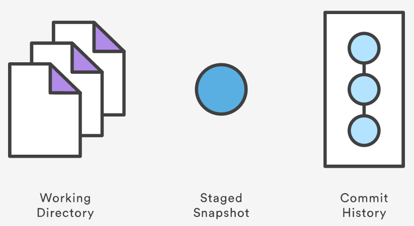
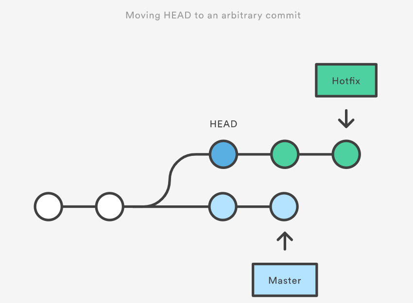

# Resetting, Checking Out & Reverting
Because they’re so similar, it’s very easy to mix up which command should be used in any given development scenario. In this section, we’ll compare the most common configurations of `git reset`, `git checkout`, and `git revert`.



A checkout is an operation that moves the `HEAD` ref pointer to a specified commit.

A revert is an operation that takes a specified commit and creates a new commit which inverses the specified commit. git revert can only be run at a commit level scope and has no file level functionality.

A reset is an operation that takes a specified commit and resets the "three trees" to match the state of the repository at that specified commit. A reset can be invoked in three different modes which correspond to the three trees. These trees are the Commit History (HEAD), the Staging Index, and the Working Directory.

Checkout and reset are generally used for making local or private 'undos'. They modify the history of a repository that can cause conflicts when pushing to remote shared repositories. Revert is considered a safe operation for 'public undos' as it creates new history which can be shared remotely and doesn't overwrite history remote team members may be dependent on.

The table below sums up the most common use cases for all of these commands. Be sure to keep this reference handy, as you’ll undoubtedly need to use at least some of them during your Git career.

|Command|Scope|Common use cases|
|:--|:--|:--|
|git reset|Commit-level|Discard commits in a private branch or throw away uncommited changes|
|git reset|File-level|Unstage a file|
|git checkout|Commit-level|Switch between branches or inspect old snapshots|
|git checkout|File-level|Discard changes in the working directory|
|git revert|Commit-level|Undo commits in a public branch|
|git revert|File-level|(N/A)|

## Commit Level Operations
The parameters that you pass to git reset and git checkout determine their scope. When you don’t include a file path as a parameter, they operate on whole commits. That’s what we’ll be exploring in this section. Note that git revert has no file-level counterpart.

### Reset A Specific Commit
On the commit-level, resetting is a way to move the tip of a branch to a different commit. This can be used to remove commits from the current branch. For example, the following command moves the `hotfix` branch backwards by two commits.

```
git checkout hotfix
git reset HEAD~2
```

The two commits that were on the end of hotfix are now dangling, or orphaned commits. This means they will be deleted the next time Git performs a garbage collection. In other words, you’re saying that you want to throw away these commits. This can be visualized as the following:


This usage of git reset is a simple way to undo changes that haven’t been shared with anyone else. It’s your go-to command when you’ve started working on a feature and find yourself thinking, “Oh crap, what am I doing? I should just start over.”

In addition to moving the current branch, you can also get `git reset` to alter the staged snapshot and/or the working directory by passing it one of the following flags:

- `--soft` – The staged snapshot and working directory are not altered in any way.
- `--mixed` – The staged snapshot is updated to match the specified commit, but the working directory is not affected. This is the default option.
- `--hard` – The staged snapshot and the working directory are both updated to match the specified commit.

### Checkout old commits
The `git checkout` command is used to update the state of the repository to a specific point in the projects history. When passed with a branch name, it lets you switch between branches.

```
git checkout hotfix
```

Internally, all the above command does is move `HEAD` to a different branch and update the working directory to match. Since this has the potential to overwrite local changes, Git forces you to commit or stash any changes in the working directory that will be lost during the checkout operation. Unlike `git reset`, `git checkout` doesn’t move any branches around.


You can also check out arbitrary commits by passing the commit reference instead of a branch. This does the exact same thing as checking out a branch: it moves the `HEAD` reference to the specified commit. For example, the following command will check out the grandparent of the current commit:

```
git checkout HEAD~2
```



This is useful for quickly inspecting an old version of your project. However, since there is no branch reference to the current `HEAD`, this puts you in a detached `HEAD` state. This can be dangerous if you start adding new commits because there will be no way to get back to them after you switch to another branch. For this reason, you should always create a new branch before adding commits to a detached `HEAD`.

### Undo Public Commits with Revert
Reverting undoes a commit by creating a new commit. This is a safe way to undo changes, as it has no chance of re-writing the commit history. For example, the following command will figure out the changes contained in the 2nd to last commit, create a new commit undoing those changes, and tack the new commit onto the existing project.

```
git checkout hotfix
git revert HEAD~2
```
Contrast this with `git reset`, which does alter the existing commit history. For this reason, `git revert` should be used to undo changes on a public branch, and `git reset` should be reserved for undoing changes on a private branch.

You can also think of `git revert` as a tool for undoing committed changes, while `git reset HEAD` is for undoing uncommitted changes.

Like `git checkout`, `git revert` has the potential to overwrite files in the working directory, so it will ask you to commit or stash changes that would be lost during the revert operation.

## File-level Operations
