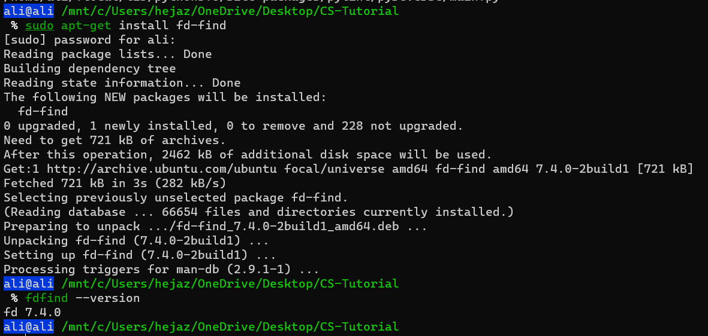

# Search for Files

Do you want to know how to perform searches on a Linux computer or server? Then you’ve come to the right place!

In this section, we’ll talk about the Linux find and locate commands, which will help you to look for any file on your machine.

Linux gives users more options on how to search for files using certain commands. Besides searching based on common filters, you are also able to find files by user permissions, size, timestamps, and so on. To do that, we’ll utilize the **find** and **locate** commands in Linux.

## Find
The most popular command to find and filter files on Linux is find. The basic syntax is as follows:

```bash
find <startingdirectory> <options> <search term>
```
The second argument `<options>` is dedicated to your file. This could be the file’s name, type, date of creation, etc. The third argument `<search term>` is where you will specify the relevant search term.

### Searching by Name
To run a simple search query using the name of the file, use the find command like this:

```bash
find . -name my-file
```
We used the `-name` option, and searched for a file called my-file. Note that we started the search in our current directory by using the `.` (dot) argument.

Keep in mind that the -name argument looks for case-sensitive terms in Linux. If you know the name of the file, but are not sure about its case-sensitivity, use the following find command:

```bash
find . -iname my-file
```

You can look for multiple files with a common format like `.txt` as well:

```bash
find . -name "*.txt"
```
This will list down all the text files starting with the current folder.

Lastly, if you want to find a certain file by name and remove it, use the -delete argument after the file name:

```bash
find . -name my-file -delete
```

**Note:** You can also use piping to delete files: `find . -name my-file | xargs rm`

### Searching by Type
Linux allows users to list all information based on their types. There are several filters that you can use:

- `d` – directory or folder
- `f` – normal file
- `l` – symbolic link
- `c` – character devices
- `b` – block devices

This will list all of the current directories in your the current directory:
```bash
find . -type d
```

You can also combine the –type and -name options to narrow down your searches further:

```
find . -type f -name my-file
```

### Searching by Time
If you want to search for files based on when they were accessed and modification time footprints. Linux keeps track of the files using these three timestamps.

- Access Time (-atime) – when the file was either read or written into.
- Modification Time (-mtime) – when the file was modified.
- Change Time (-ctime) – when the file’s meta-data was updated.

**Note:** "Modify" is the timestamp of the last time the file's content has been mofified. This is often called "mtime". "Change" is the timestamp of the last time the file's inode has been changed, like by changing permissions, ownership, file name, number of hard links. It's often called "ctime"

This option has to be used with a number that specifies how many days passed since the file was accessed, modified or changed:


|Command|Description|
|:--|:--|
|`find . -atime 1`|This command will show all files that were accessed a day ago starting from your current time.|
|`find . -mtime +2`|It lists down all the files that have a modification time of more than two days ago.|
|`find . -ctime -1`|To find all files whose meta-data was updated less than a day ago.|
|`find . -mmin -1`|The `-mmin` argument looks for modified files on a minute basis.|
|`find . -newer my-file`|Compare the age of two or more files and display the newer one.|

### Searching by Size
Linux lets you search for files based on their sizes. The syntax for searching files by size is:

```bash
find <startingdirectory> -size <size-magnitude> <size-unit>
```

You can specify the following size units:
- c – bytes
- k – kilobytes
- M – megabytes
- G – gigabytes
- b – 512-byte chunks

|Command|Description|
|:--|:--|
|`find . -size 10M`|Search for all of the files that are exactly 10 megabytes.|
|`find . -size +5G`|Search for all the files that are more than five gigabytes in size.|

### Searching by Ownership
|Command|Description|
|:--|:--|
|`find . -user ali`|Return a list of all files that the user named `ali` owns.|
|`find . -group ali`|Similar to usernames, we can also find files through group names.|

### Searching by Permission
Users can search for files based on file permissions using  `-perm` option.

|Command|Description|
|:--|:--|
|`find . -perm 644`|Search for all the files that have only read and write permissions..|
|`find . -size -644`|Search for all the files that have at least 644 permission.|

### Other Useful Options
|Command|Description|
|:--|:--|
|`find . -empty`|Look for empty files and folders.|

## Locate
The locate command is a useful alternative, as it is faster than the find command when performing searches. That’s because the former only scans your Linux database instead of the whole system. Furthermore, the syntax is relatively easier to write.

### How to Install locate Package
By default, Linux does not come with the locate command pre-installed. To get the package, run the following commands one after another:

```bash
sudo apt-get update
sudo apt-get install mlocate
```


### Search Exact File Name

The basic syntax only allows you to search for files that contain the search term. If you want to get the file with the exact name, you can use the `-r` option to search with regular expression and add dollar symbol `($)` at the end of your search term, for example:

```bash
locate -r my-file$
```

### Count the Number of Files

In order to tell how many files appear on your search result, insert -c after the locate command.

```bash
locate -c my-file
```

You can also use piping with `wc` (word count) command that counts number of lines, words, and characters:

```bash
locate my-file | wc -l
```

`wc`:
- `wc -l`: number of lines
- `wc -w`: number of words
- `wc -c`: number of characters

### Ignore Case Sensitive
Use `-i` on your linux locate command to ignore case sensitive files. For instance:

```bash
locate -i my-file
```

### Show Existing Files
Linux locate command can even show you a deleted file if you haven’t updated the database. Thankfully, you can get around this problem by using `-e` option, like this:

```bash
locate -e my-file
```

By doing this, you will only get files that exist at the time you perform the locate command.

If you have created new files and want to include them in the search results, you have o update the locate database. To do so run:
```bash
sudo updatedb
```

### Limit the Number of Search Results
If you want to limit the number of search results, `-n <number>` will do the trick. However, remember that you need to put the option at the end of the command line. Take a look at this example:
```bash
locate my-file -n 10
```

## `fd` Command
The fd command isn’t meant to replace the traditional find command, which has been on Linux, well, forever. Instead, `fd` tries to satisfy the majority of common uses of find in a more straightforward way—and, it’s often eight or nine times faster than find. You can see some of its benchmarks on the project’s GitHub repository page.

`fd` has a colorized output, similar to that of some ls modes. It’s recursive, but doesn’t search hidden directories by default. It knows about Git and will also automatically ignore any patterns in your `.gitignore` file.

`fd` is case insensitive by default. However, if your search pattern contains an uppercase letter, `fd` operates in a case sensitive mode. Of course, you can override the defaults, but, in many cases, they work in your favor.

### Installing `fd`
Type the following:
```bash
sudo apt-get install fd-find
```
In Ubuntu, the command is fdfind to avoid a name clash with another existing utility. If you want it to be `fd`, you can set up an alias

```bash
alias fd=fdfind
```

### Simple Searches with `fd`
If you use fd with no command-line options, it behaves a little like ls, except it lists files in subdirectories by default.

```bash
fdfind
```

To see files of a specific type, use the `-e` (extension) option. Note that you don’t have to precede the extension with a period `(.)`, nor is it case sensitive.

For example, you could type the following:
```bash
fdfind -e png
```

To look for a single file, type its name on the command line, like so:
```bash
fdfind myfile.txt
```

To have the search start in a particular directory, include a file path on the command line. The following command will start a search in the `/etc` directory, and look for files that include `myfile` in the file name:

```bash
fdfind myfile /etc
```

### File Types and Case Sensitivity
You can ask `fd` to look for directories, files (including those that are executable and empty), and symbolic links. You can do so by using the -t (type) option, followed by one of the letters below:

- `f`: File.
- `d`: Directory.
- `l`: Symbolic link.
- `x`: Executable file.
- `e`: Empty file.

The following looks for a directory called images:
```bash
fdfind -t d images
```

Let’s see how case sensitivity works with search patterns. We type the following to first search for files that contain “geo” in their file names, and then for those that contain “Geo” in their file names:

- `fdfind -tf geo`
- `fdfind -tf Geo`

In the first command, we used a lowercase search pattern, which caused fd to operate in a case-insensitive way. This means both `Geo` and `geo` are valid matches.

Our second command contained an uppercase character, which caused fd to operate in a case-sensitive manner. This means only `Geo` is a valid match.

## Summary

You can search for files on your server using the find and locate commands in Linux. These two powerful tools have their own advantages. Therefore, we encourage you to give both of them a go and see which one is more suitable for you. Here’s a short summary of what we talked about:

- Use **find** to search for files based on name, type, time, size, ownership and permissions, in addition to some other useful options
- Install and use Linux **locate** command to perform faster system-wide searches for files. It also allows you to filter out by name, case-sensitive, folder, and so on.


